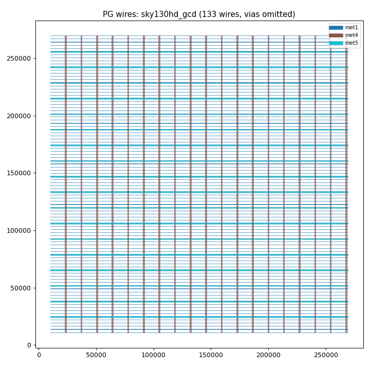

# Phase 3 报告：PG 几何抽取（4 设计）

日期：2026-09-26 PDT

## 重要偏离（相对执行手册）

手册假设用 Python 解析 DEF `SPECIALNETS` 段。实际该版本 `write_def` 把
stripe wire 写成**单点 + via 名、宽度 0**（`+ ROUTED met4 0 + SHAPE STRIPE ( x y ) via4_...`），
wire 矩形信息丢失，DEF 解析不可行。

改用手册建议的备选方案：**直接从 odb 读 special wire**。
conda 版 OpenROAD 无 Python `openroad` 模块，改用 Tcl API 实现：
- `src/dump_pg.tcl`：`read_db` → 遍历 POWER/GROUND net → `getSWires`/`getWires`
  → 每个 dbSBox 输出 `net,shape,layer,x1,y1,x2,y2,via_name,via_bot,via_top`（`pg_raw.csv`）
- `src/pg_extract.py`：`pg_raw.csv` → `pg_shapes.csv`
  （列：net,layer,shape,kind,x1,y1,x2,y2,width,via_name；kind=wire/via，
  via 的 layer 记为 `bot-top` 跨度），并从 DEF 解析 `design_meta.json`
  （dbu/die/core/row_height/macros/shape 计数）

该路线反而比 DEF 解析更精确：拿到的是 odb 中的真实矩形（含 via 盒尺寸与层跨度）。

## 抽取结果

| 设计 | wires | vias | 结构 |
|---|---|---|---|
| sky130hd/gcd | 133 | 2907 | met1 rails(96) + met4(19)/met5(18) straps；via 栈 met1→met4（3×912）+ met4-met5（171） |
| nangate45/gcd | 65 | 279 | metal1 rails(58) + metal4(3)/metal7(4) straps；via 栈 metal1→metal4、metal4→metal7 |
| sky130hd/aes | 318 | 16403 | 同 sky130hd/gcd 结构，规模 ~2.4× |
| asap7/gcd | 114 | 432 | **M1+M2 双层 rails**（各53）+ M5(4)/M6(4) straps；via 栈 M1→M5、M5-M6 |

## 自检（全部通过）

1. wire/via 计数与 DEF grep 量级一致（STRIPE 行数 = stripe wires + stripe vias）。
2. 全部 wire 为轴对齐矩形，长轴方向唯一（H/V），无斜线。
3. STRIPE/RING wire 方向与 LEF preferred direction 一致（0 mismatch；
   FOLLOWPIN 豁免：rail 沿 row 方向是定义使然，asap7 的 M1 首选方向为垂直，
   初版检查误报 53 处，已修正）。
4. 每个设计一张分层 PNG：`reports/phase-3_<tag>.png`（sky130hd_gcd 见下：met1 蓝色密线、
   met4 棕色竖条、met5 青色横条，网格规整）。

## 关键发现（已用源码验证，供 Phase 4/论文使用）

1. **stripe offset 参照系**：不是 die 原点也不是 core 原点，而是 pdngen 内部
   "core area" = stdcell row 并集向 Y 扩展 ±rail_width/2
   （`PdnGen.tcl:4961` 注释明示 "larger than the stdcell area by half a rail"）。
   sky130hd/gcd：met4 首条 VDD 中心 23690 = 10120 + 13570 ✓；
   met5 首条 VDD 中心 24240 = (10880 − 240) + 13600 ✓（240 = 480/2）。
2. **VSS 网格 = VDD 网格 + pitch/2**（`stripes_start_with POWER` 且无 spacing 时），
   VDD/VSS 各自是完整 pitch 网格（非交错单网格）。
3. **`rails_start_with` 是死参数**：在 PdnGen.tcl 全文出现 0 次，从未被读取；
   rail 的 VDD/VSS 归属完全由 row orientation 决定（R0 行：VDD 在上；MX 行：VDD 在下）。
4. rail 位置完全由 DEF ROW 语句决定（row 边界 ± rail_width/2），共 96 条（95 行 → 96 边界）。

## Pass 判定

✅ 通过。4 设计的 `pg_shapes.csv` + `design_meta.json` + 自检 + PNG 齐全，
几何完整、方向一致，可作为 Phase 4 反推输入。
